# 6 App 反爬虫
- Web 站点有多种渲染和反爬方式，渲染分为服务端渲染和客户端渲染；反爬也是多种多样，
- 如请求头验证、WebDriver 限制、验证码、字体反爬、封禁 IP、账号验证等等，
- 综合来看 Web 端的反爬虫方案也是多种多样

- App 的情况略有不同，一般来说，App 的数据通信大都需要依赖独立的服务器，
- 比如请求某个 HTTP 接口来获取数据或做登录校验等。这种通信其实就类似 Web 中的 Ajax，
- 客户端向服务器发起 HTTP 请求，获取到数据之后再做一些处理，数据的格式大多也是 JSON、XML 等，
- 基本不会有 HTML 代码这样的数据，所以说，对于 App 来说，其核心就在于找到这些数据请求到底是怎样的，
- 比如某次 HTTP POST 请求的 URL、Headers、Data 等等，知道了这些，
- 我们就能用程序模拟这个请求过程，从而就能完成爬虫了。


## 6.1 App 抓包
- App 到底在运行过程中发起了什么请求呢？最有效且常见的方式就是抓包了，抓包工具也非常多，
- 比如 Fiddler、Charles、mitmproxy、anyproxy 等等，我们用这些工具抓到 HTTP 请求包，
- 就能看到这个请求的 Method、Headers、Data 等内容了，知道了之后再用程序模拟出来就行了。
- 抓包是利用第三方作为代理，实现监听网络传输与收发数据的行为

- App 的数据也是非常宝贵的，所以一些 App 也添加了各种反爬措施，比如：
    - 这个 App 的请求根本抓不到包，原因可能是 App 本身设置了不走系统代理。
    - 对一些 HTTPS 的请求，抓包失败，原因可能是系统或 App 本身设置了 SSL Pining，对 HTTPS 证书进行了校验，代理软件证书校验不通过，拒绝连接。
    - 某些包即使抓到了，也发现了其中带了加密参数，比如 sign、token 等等，难以直接用程序模拟。
    - 为了破解一些加密参数可能需要对 App 进行逆向，逆向后发现是混淆后的代码，难以分析逻辑。
    - 一些 App 为了防止逆向，本身进行了加固，需要对 App 进行脱壳处理才能进行后续操作。
    - 一些 App 将核心代码进行编译，形成 so 库，因此可能需要对 so 库进行逆向才能了解其逻辑。
    - 一些 App 和其服务器对以上所有的流程进行了风控处理，如果发现有疑似逆向或破解或访问频率等问题，返回一些假数据或拒绝服务，导致爬虫难以进行。

### 6.1.1 App 抓包
- 抓包
    - 对于多数情况来说，一台 Android 7.0 版本以下的手机，抓一些普通的 App 的请求包还是很容易做到的。
    - 抓包的工具有很多，常见的如 Charles、Fiddler、mitmproxy、Wireshark等。
    - 注意抓包软件和要抓包的电脑或者手机要处于同一个网络

- 抓包过程
    - 抓包的时候在 PC 端运行抓包软件，抓包软件会开启一个 HTTP 代理服务器，
    - 然后手机和 PC 连在同一个局域网内，设置好抓包软件代理的 IP 和端口，
    - 另外 PC 和手机都安装抓包软件的证书并设置信任。
    - 这样在手机上再打开 App 就能看到 App 在运行过程中发起的请求了。

- 抓包数据
    - 抓包完成之后在抓包软件中定位到具体数据包，查看其详情，
    - 了解其请求 Method、URL、Headers、Data，如果这些没有什么加密参数的话，
    - 我们用 Python 重写一遍就好了。
    - 当然如果遇到抓不到包或者有加密参数的情形，无法直接重写，那就要用到后面介绍的方法了。

### 6.1.2 App 代理抓不到包
- 抓不到包
    - 一些 App 在内部实现的时候对代理加了一些校验，
    - 如绕过系统代理直接连接或者检测到了使用了代理，直接拒绝连接。
    - 这种情形往往是手机的 HTTP 客户端对系统的网络环境做了一些判断，
    - 并修改了一些 HTTP 请求方式，使得数据不走代理，这样抓包软件就没法直接抓包了。
    - 另外对于一些非 HTTP 请求的协议，利用常规的抓包软件也可能抓不到包。这里提供一些解决方案。

- 强制全局代理
    - 虽然有些数据包不走代理，但其下层还是基于 TCP 协议的，所以可以将 TCP 数据包重定向到代理服务器。
    - 比如软件 ProxyDroid 就可以实现这样的操作，这样我们就能抓到数据包了。
    - ProxyDroid：https://github.com/madeye/proxydroid

- 手机代理
    - 如果不通过 PC 上的抓包软件设置代理，还可以直接在手机上设置抓包软件，
    - 这种方式是通过 VPN 的方式将网络包转发给手机本地的代理服务器，
    - 代理服务器将数据发送给服务端，获取数据之后再返回即可。
    - 使用了 VPN 的方式，我们就可以截获到对应的数据包了，
    - 一些工具包括 HttpCanary、Packet Capture、NetKeeper 等。
        - HttpCanary：https://play.google.com/store/apps/details?id=com.guoshi.httpcanary
        - Packet Capture：https://play.google.com/store/apps/details?id=app.greyshirts.sslcapture
        - NetKeeper：https://play.google.com/store/apps/details?id=com.minhui.networkcapture.pro
        - 以上应用链接来源于 Google Play，也可以在国内应用商店搜索或直接下载 apk 安装。

- 特殊协议抓包
    - 可以考虑使用 Wireshark、Tcpdump 在更底层的协议上抓包，比如抓取 TCP、UDP 数据包等等。
    - 使用的时候建议直接 PC 上开热点，然后直接抓取 PC 无线网卡的数据包，
    - 这样 App 不管有没有做系统代理校验或者使用了非 HTTP 协议，都能抓到数据包了。


### 6.1.3 SSL Pining
- SSL Pining，就是证书绑定，这个只针对 HTTPS 请求。
- SSL Pining 发生在下面的一些情况：
    - 对于 Android 7.0 以上的手机，系统做了改动，HTTPS 请求只信任系统级别证书，
    - 这会导致系统安全性增加，但是由于抓包软件的证书并不是系统级别证书，就不受信任了，那就没法抓包了。
    - 一些 App 里面专门写了逻辑对 SSL Pining 做了处理，对 HTTPS 证书做了校验，
    - 如果发现是不在信任范围之内的，那就拒绝连接。对于这些操作，我们通常有两种思路来解决：

- SSL Pining 解决方法    
    - 让系统信任我们的 HTTPS 证书；
    - 绕开 HTTPS 证书的校验过程。
    - 对于这两种思路，有以下一些绕过 SSL Pining 的解决方案。

- 方案1：修改 App 的配置
    - 如果是 App 的开发者或者把 apk 逆向出来了，那么可以直接通过修改 AndroidManifest.xml 文件，
    - 在 apk 里面添加证书的信任规则即可，
    - 详情可以参考 https://crifan.github.io/app_capture_package_tool_charles/website/how_capture_app/complex_https/https_ssl_pinning/，
    - 这种思路属于第一种信任证书的解决方案。

- 方案2：将证书设置为系统证书
    - 当然也可以将证书直接设置为系统证书，只需要将抓包软件的证书设置为系统区域即可。
    - 但这个前提是手机必须要 ROOT，而且需要计算证书 Hash Code 并对证书进行重命名，
    - 具体可以参考 https://crifan.github.io/app_capture_package_tool_charles/website/how_capture_app/complex_https/https_ssl_pinning，
    - 这种思路也是第一种信任证书的解决方案。
    
- 方案3：Xposed + JustTrustMe
    - Xposed 是一款 Android 端的 Hook 工具，利用它我们可以 Hook App 里面的关键方法的执行逻辑，绕过 HTTPS 的证书校验过程。
    - JustTrustMe 是基于 Xposed 一个插件，它可以将 HTTPS 证书校验的部分进行 Hook，改写其中的证书校验逻辑，
    - 这种思路是属于第二种绕过 HTTPS 证书校验的解决方案。
    - 当然基于 Xposed 的类似插件也有很多，如 SSLKiller、sslunpining 等等，可以自行搜索。
    - 不过 Xposed 的安装必须要 ROOT，如果不想 ROOT 的话，可以使用后文介绍的 VirtualXposed。

- 方案4：Frida
    - Frida 也是一种类似 Xposed 的 Hook 软件，使用它我们也可以实现一些 HTTPS 证书校验逻辑的改写，
    - 这种思路也是属于第二种绕过 HTTPS 证书校验的方案。
    - 具体可以参考 https://codeshare.frida.re/@pcipolloni/universal-android-ssl-pinning-bypass-with-frida/。
    
- 方案5：VirtualXposed
    - Xposed 的使用需要 ROOT，如果不想 ROOT 的话，可以直接使用一款基于 VirtualApp 开发的
    - VirtualXposed 工具，它提供了一个虚拟环境，内置了 Xposed。
    - 我们只需要将想要的软件安装到 VirtualXposed 里面就能使用 Xposed 的功能了，
    - 然后配合 JustTrustMe 插件也能解决 SSL Pining 的问题，
    - 这种思路是属于第二种绕过 HTTPS 证书校验的解决方案。
    
- 方案5：特殊改写
    - 对于第二种绕过 HTTPS 证书校验的解决方案，其实本质上是对一些关键的校验方法进行了 Hook 和改写，
    - 去除了一些校验逻辑。但是对于一些代码混淆后的 App 来说，其校验 HTTPS 证书的方法名直接变了，
    - 那么 JustTrustMe 这样的插件就无法 Hook 这些方法，因此也就无效了。
    - 所以这种 App 可以直接去逆向，找到其中的一些校验逻辑，
    - 然后修改写 JustTrustMe 的源码就可以成功 Hook 住了，也就可以重新生效了。

- 方案6：逆向秘钥
    - 上面都是信任或者绕过证书验证，还有一种硬解的方法，逆向秘钥，
    - 可以直接逆向 App，反编译得到证书秘钥，使用秘钥来解决证书限制。


## 6.2 逆向   
- 以上解决了一些抓包的问题，但是还有一个问题，就是抓的数据包里面带有加密参数怎么办？
- 比如一个 HTTP 请求，其参数还带有 token、sign 等参数，即使我们抓到包了，那也没法直接模拟啊？
- 所以我们可能需要对 App 进行一些逆向分析，找出这些加密过程究竟是怎样的。
- 这时候我们就需要用到一些逆向工具了。下面是一些常用的逆向工具

- JEB
    - JEB 是一款适用于 Android 应用程序和本机机器代码的反汇编器和反编译器软件。
    - 利用它我们可以直接将安卓的 apk 反编译得到 Smali 代码、jar 文件，获取到 Java 代码。
    - 有了 Java 代码，我们就能分析其中的加密逻辑了。
    - JEB：https://www.pnfsoftware.com/

- JADX
    - 与 JEB 类似，JADX 也是一款安卓反编译软件，可以将 apk 反编译得到 jar 文件，
    - 得到 Java 代码，从而进一步分析逻辑。
    - JADX：https://github.com/skylot/jadx

- dex2jar、jd-gui
    - 这两者通常会配合使用来进行反编译，同样也可以实现 apk 文件的反编译，
    - 但其用起来个人感觉不如 JEB、JADX 方便。

- 脱壳
    - 一些 apk 可能进行了加固处理，所以在反编译之前需要进行脱壳处理。
    - 一般来说可以先借助于一些查壳工具查壳，如果有壳的话可以借助于 Dumpdex、FRIDA-DEXDump 等工具进行脱壳。
    - FRIDA-DEXDump：https://github.com/hluwa/FRIDA-DEXDump
    - Dumpdex：https://github.com/WrBug/dumpDex

- 反汇编
    - 一些 apk 里面的加密可能直接写入 so 格式的动态链接库里面，要想破解其中的逻辑，
    - 就需要用到反汇编的一些知识了，这里可以借助于 IDA 这个软件来进行分析。
    - IDA：https://www.hex-rays.com/

- 以上的一些逆向操作需要较深的功底和安全知识，在很多情况下，如果逆向成功了，
- 一些加密算法还是能够被找出来的，找出来了加密逻辑之后，我们用程序模拟就方便了。


## 6.3 模拟
- 逆向对于多数有保护 App 是有一定作用的，但有的时候 App 还增加了风控检测，
- 一旦 App 检测到运行环境或访问频率等信息出现异常，那么 App 或服务器就可能产生防护，
- 直接停止执行或者服务器返回假数据等都是有可能的。
- 对于这种情形，有时候我们就需要回归本源，真实模拟一些 App 的手工操作了。

- adb
    - 最常规的 adb 命令可以实现一些手机自动化操作，但功能有限。

- 触动精灵、按键精灵
    - 有很多商家提供了手机 App 的一些自动化脚本和驱动，如触动精灵、按键精灵等，
    - 利用它们的一些服务我们可以自动化地完成一些 App 的操作。
    - 触动精灵：https://www.touchsprite.com/

- Appium
    - 类似 Selenium，Appium 是手机上的一款移动端的自动化测试工具，也能做到可见即可爬的操作。
    - Appium：http://appium.io/

- AirTest
    - 同样是一款移动端的自动化测试工具，是网易公司开发的，相比 Appium 来说使用更方便。
    - AirTest：http://airtest.netease.com/

- Appium/AirTest + mitmdump
    - mitmdump 其实是一款抓包软件，与 mitmproxy 是一套工具。
    - 这款软件配合自动化的一些操作就可以用 Python 实现实时抓包处理了。
    - mitmdump：https://mitmproxy.readthedocs.io/
    - 到此，App 的一些爬虫思路和常用的工具就介绍完了，在后面的课时我们会使用其中一些工具来进行实战演练。

- ## 6.1 - ## 6.3 章节内容参考资料
    - 参考来源
    - https://zhuanlan.zhihu.com/webspider
    - https://www.zhihu.com/question/60618756/answer/492263766
    - https://www.jianshu.com/p/a818a0d0aa9f
    - https://mp.weixin.qq.com/s/O6iWb2VL4SH9UNLwk2FCMw
    - https://zhuanlan.zhihu.com/p/60392573
    - https://crifan.github.io/app_capture_package_tool_charles/website/
    - https://github.com/WooyunDota/DroidDrops/blob/master/2018/SSL.Pinning.Practice.md

## 6.4 抓包利器 Charles 的使用
- Charles 是一个网络抓包工具，我们可以用它来做 App 的抓包分析，得到 App 运行过程中发生的所有网络请求和响应内容，
- 这就和 Web 端浏览器的开发者工具 Network 部分看到的结果一致。

- Charles、Fiddler 等都是非常强大的 HTTP 抓包软件，功能基本类似，不过 Charles 的跨平台支持更好。
- 所以我们选用 Charles 作为主要的移动端抓包工具，用于分析移动 App 的数据包，辅助完成 App 数据抓取工作。

- 目标：
    - 电影示例 scrap App 为例，通过 Charles 抓取 App 运行过程中的网络数据包，
    - 然后查看具体的 Request 和 Response 内容，以此来了解 Charles 的用法。
    - 同时抓取到数据包之后，我们采用 Python 将请求进行改写，从而实现 App 数据的爬取
    
- 准备工作：
    - 请确保已经正确安装 Charles 并开启了代理服务，另外准备一部 Android 手机，系统版本最好是在 7.0 以下。
    - 如果系统版本在 7.0 及以上，可能出现 SSL Pining 的问题，可以参考第一课时的思路来解决。
    - 然后手机连接 Wi-Fi，和 PC 处于同一个局域网下，另外将 Charles 代理和 Charles CA 证书设置好，同时需要开启 SSL 监听。
    - 此过程的配置流程可以参见：https://cuiqingcai.com/5255.html。
    - 最后手机上安装本节提供的 apk（apk 随课件一同领取），进行接下来的 Charles 抓包操作。
    - scrape apk链接: https://pan.baidu.com/s/1gmsQ6k5aABdyxghfgLIOcw 提取码: 4bxn
    
    - 参考地址：
    - Charles相关链接
        - 官方网站：https://www.charlesproxy.com
        - 下载链接：https://www.charlesproxy.com/download
        - 安装参考网址：https://cuiqingcai.com/5255.html
        - 安装查看03_Charles_安装及使用
    
    - 准备工作查看03_Charles_安装及使用，设置成功后就可以开始访问APP，然后开始抓包了
    
- Charles 原理
    - 首先将 Charles 运行在自己的 PC 上，
    - Charles 运行的时候会在 PC 的 8888 端口开启一个代理服务，
    - 这个服务实际上是一个 HTTP/HTTPS 的代理。
    - 确保手机和 PC 在同一个局域网内，我们可以使用手机模拟器通过虚拟网络连接，
    - 也可以使用手机真机和 PC 通过无线网络连接。
    - 设置手机代理为 Charles 的代理地址，这样手机访问互联网的数据包就会流经 Charles，
    - Charles 再转发这些数据包到真实的服务器，服务器返回的数据包再由 Charles 转发回手机，
    - Charles 就起到中间人的作用，所有流量包都可以捕捉到，
    - 因此所有 HTTP 请求和响应都可以捕获到。同时 Charles 还有权力对请求和响应进行修改。
        
## 6.5 抓包利器 Charles 的使用实例
- 6.4 节已经已经了准备工作，本节使用 Charles 爬取 App 的数据
- 关键是找到app数据的api接口，即请求数据的url地址及其规律

- 抓包
    - 电脑打开 Charles 软件，开启监听，然后手机打开 scrape APP，然后向下滚动 app 
    - app加载了第一页和第二页，Charles 上面已经抓取到两页的内容
    - 右侧工具栏：概述显示一些爬取信息，内容里面显示爬取到的具体数据
    - 查看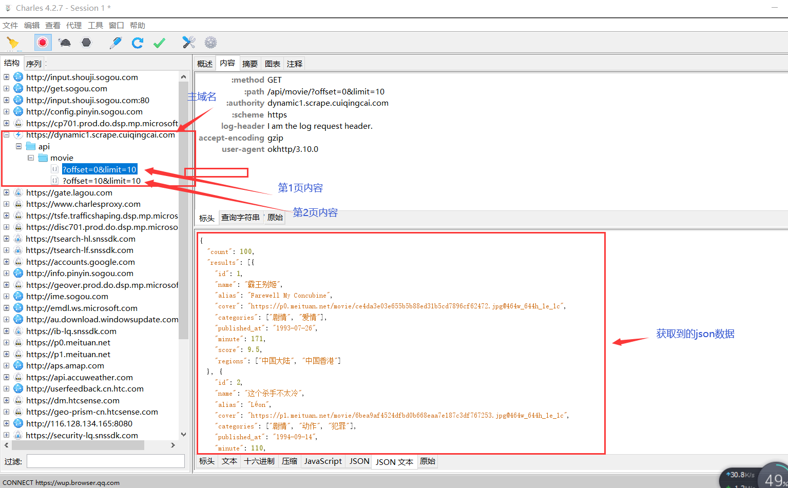
    - 右侧工具栏底部，可以切换查看不同响应结果不同的数据格式

- 分析
    - 内容 (Contents) 选项卡，查看该请求和响应的详情信息。
    - 上半部分显示的是 请求 Request 的信息，下半部分显示的是 响应 Response 的信息。
    - 比如针对 Request，我们切换到 Headers 选项卡即可看到该 Request 的 Headers 信息，
    - 针对 Response，我们切换到 JSON Text 选项卡即可看到该 Response 的 Body 信息，并且该内容已经被格式化
    - 由于这个请求是 GET 请求，所以我们还需要关心的就是 GET 的参数信息，切换到 Query String （查询字符串）选项卡即可查看
    - 通过抓包已经获取到 App 中的电影数据接口的请求（地址）和 响应内容，并且可以查看 Response 返回的 JSON 数据。
    - 至于其他 App，我们同样可以使用这样的方式来分析
    - 查看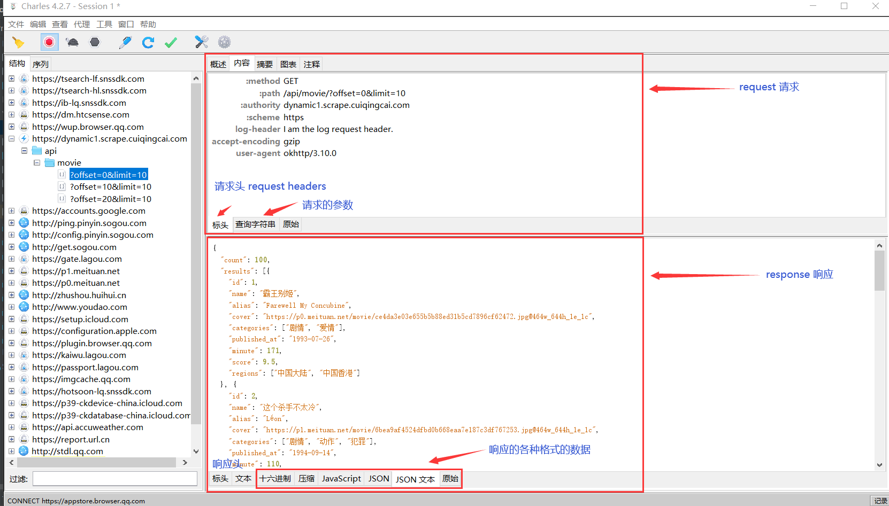

- 重发
    - Charles 还有一个强大功能，它可以将捕获到的请求加以修改并发送修改后的请求。
    - 点击上方的修改按钮（一支笔一样的图标），左侧列表就多了一个以编辑图标为开头的链接，
    - 这就代表此链接对应的请求正在被我们修改，右侧工具栏里面进行修改
    - 将参数中的某个字段修改下，比如这里将 offset 字段由 0 修改为 10。
    - 这时我们已经对原来请求携带的 Query 参数做了修改，然后点击下方的 Execute 按钮即可执行修改后的请求
    - 左侧列表再次出现了接口的请求结果，内容变成了第 11~20 条内容
    - 有了重发这个功能，我们就可以方便地使用 Charles 来做调试，
    - 可以通过修改参数、接口等来测试不同请求的响应状态，
    - 就可以知道哪些参数是必要的哪些是不必要的，以及参数分别有什么规律，
    - 最后得到一个最简单的接口和参数形式以供程序模拟调用使用。
    - 查看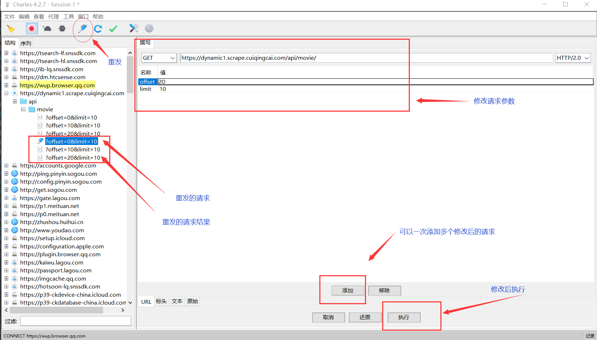
    
- 模拟
    - 现在我们已经成功完成了抓包操作了，所有的请求一目了然，
    - 请求的 URL 就是 https://dynamic1.scrape.cuiqingcai.com/api/movie/，
    - 后面跟了两个 GET 请求参数。经过观察，可以很轻松地发现 offset 就是偏移量，limit 就是一次请求要返回的结果数量。
    - 比如 offset 为 20，limit 为 10，就代表获取第 21~30 条数据。
    - 另外我们通过观察发现一共就是 100 条数据，offset 从 0 到 90 遍历即可。
    
- python 模拟实现

```python
import requests

BASE_URL = 'https://dynamic1.scrape.cuiqingcai.com/api/movie?offset={offset}&limit=10'
for i in range(0, 10):
    offset = i * 10
    url = BASE_URL.format(offset=offset)
    data = requests.get(url).json()
    print('data', data)
```

## 6.5 实时处理利器 mitmproxy 的使用
- mitmproxy 是一个支持 HTTP 和 HTTPS 的抓包程序，
- 有类似 Fiddler、Charles 的功能，只不过它是一个控制台的形式操作。
- 通过运行python脚本，对访问请求进行实时处理，用的最多就是对访问的响应内容进行实时的保存下来为json文件
- mitmproxy 还有两个关联组件。
    - 一个是 mitmdump，它是 mitmproxy 的命令行接口，利用它我们可以对接 Python 脚本，用 Python 实现实时监听后的处理。
    - 另一个是 mitmweb，它是一个 Web 程序，通过它我们可以清楚观察 mitmproxy 捕获的请求。

### 6.5.1 mitmproxy 的功能
- mitmproxy 有如下几项功能。
    - 拦截 HTTP 和 HTTPS 请求和响应；
    - 保存 HTTP 会话并进行分析；
    - 模拟客户端发起请求，模拟服务端返回响应；
    - 利用反向代理将流量转发给指定的服务器；
    - 支持 Mac 和 Linux 上的透明代理；
    - 利用 Python 对 HTTP 请求和响应进行实时处理。

### 6.5.2 抓包原理
- 和 Charles 一样，mitmproxy 运行于自己的 PC 上，mitmproxy 会在 PC 的 8080 端口运行，
- 然后开启一个代理服务，这个服务实际上是一个 HTTP/HTTPS 的代理。

- 手机和 PC 在同一个局域网内，设置代理为 mitmproxy 的代理地址(即手机代理设置为电脑主机的IP地址，端口8080)，
    - 这样手机在访问互联网的时候流量数据包就会流经 mitmproxy，
    - mitmproxy 再去转发这些数据包到真实的服务器，服务器返回数据包时再由 mitmproxy 转发回手机，
    - 这样 mitmproxy 就相当于起了中间人的作用，抓取到所有 Request 和 Response，
    - 另外这个过程还可以对接 mitmdump，抓取到的 Request 和 Response 的具体内容都可以直接用 Python 来处理，
    - 比如得到 Response 之后我们可以直接进行解析，然后存入数据库，这样就完成了数据的解析和存储过程。

### 6.5.3 mitmproxy 使用
- 要启动 mitmproxy 用 mitmproxy(windows平台不能使用)、mitmdump、mitmweb 这三个命令中的任意一个即可，
    - 这三个命令功能一致，且都可以加载自定义脚本，唯一的区别是交互界面的不同。
    - 但是他们各有特点，mitmproxy是进行抓包调试使用的，mitmweb是mitmproxy的可视版本，浏览器会打开一个http://127.0.0.1:8081/#/flows可视化界面
    - mitmdump主要是加载脚本执行的，因为mitmdump抓取的信息是不主动显示的，mitmdump在CMD窗口显示所有请求的信息
    - mitmdump由我们在脚本中使用特定打印方式，输出到界面，方便我们调试，当然也可以直接使用print打印。

- 在控制台中输入mitmdump -h，可以查看命令行帮助，我们主要使用的是-s和-p参数，
    - -p指定监听端口，默认端口为8080，如果和其他软件有冲突，可以通过此参数修改；
    - -s指定执行脚本，这个就是我们用mitmproxy的主要作用，通过加载脚本，执行请求过程的中间处理，修改请求数据或者保存返回数据。

- 准备工作完成后，CMD启动：mitmdump
    - 手机打开 scrape app，然后向下滚动网页，mitmdump就监听获取了所有的请求信息
    - 每个请求开头都有一个 GET 或 POST，这是各个请求的请求方式。紧接的是请求的 URL。
    - 第二行开头的数字就是请求对应的响应状态码，后面是响应内容的类型，如 text/html 代表网页文档、image/gif 代表图片。
    - 再往后是响应体的大小和响应的时间。
    - 查看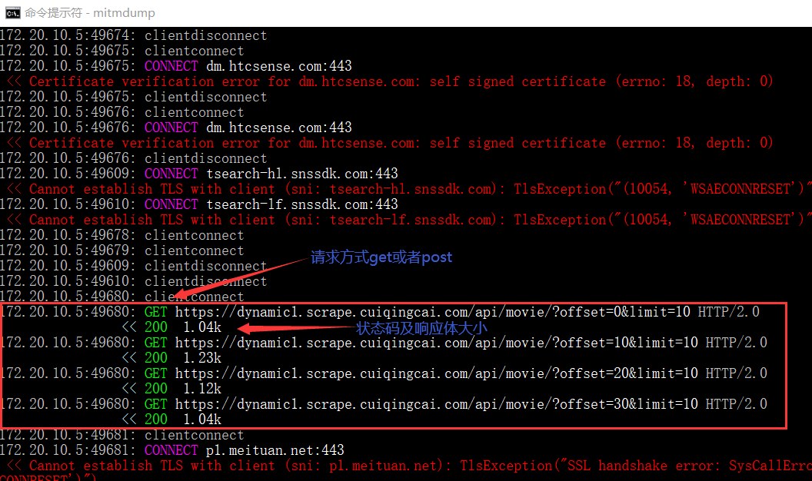

- mitmdump 使用    
    - mitmdump 是 mitmproxy 的命令行接口，同时还可以对接 Python 对请求进行处理，这是相比 Fiddler、Charles 等工具更加方便的地方。
    - 有了它我们可以不用手动截获和分析 HTTP 请求和响应，只需写好请求和响应的处理逻辑即可。
    - 它还可以实现数据的解析、存储等工作，这些过程都可以通过 Python 实现。
    
    - 使用命令启动 mitmproxy，并把截获的数据保存到文件中，命令如下所示：
        - mitmdump -w outfile
        - 其中 outfile 的名称任意，截获的数据都会被保存到此文件中。
    - 还可以指定一个脚本来处理截获的数据，使用 - s 参数即可：
        - mitmdump -s script.py
        - 这里指定了当前处理脚本为 script.py，它需要放置在当前命令执行的目录下。
        - 脚本里写入如下的代码
```python
def request(flow):
    flow.request.headers['User-Agent'] = 'MitmProxy'
    print(flow.request.headers)
```
- 定义了一个 request 方法，参数为 flow，它其实是一个 HTTPFlow 对象，
- 通过 request 属性即可获取到当前请求对象。然后打印输出了请求的请求头，
- 将请求头的 User-Agent 修改成了 MitmProxy。
- 在当前python脚本文件夹运行，mitmdump -s script.py，我们就对request的请求头的 User-Agent 修改成了 MitmProxy
- 手机端访问 http://httpbin.org/get，就可以看见修改后的内容


- Request 方法
    - 上面脚本我们实现了 request 方法并且对 Headers 进行了修改。
    - 下面我们来看看 Request 还有哪些常用的功能。我们先用一个实例来感受一下。
```python
from mitmproxy import ctx

def request(flow):
    request = flow.request
    info = ctx.log.info
    info(request.url)
    info(str(request.headers))
    info(str(request.cookies))
    info(request.host)
    info(request.method)
    info(str(request.port))
    info(request.scheme)
```
- 先打开一个cmd窗口，激活虚拟环境，切换到脚本文件位置
    - 执行 mitmdump -s mitmproxy_request.py 运行脚本后，监听启动
    - 然后手机访问一个百度，结果中分别输出了请求链接、请求头、请求 Cookies、请求 Host、请求方法、请求端口、请求协议这些内容。
- 同时我们还可以对任意属性进行修改，就像最初修改 Headers 一样，直接赋值即可,比如将访问的网页地址进行修改掉
```python
def request(flow):
    url = 'https://httpbin.org/get'
    flow.request.url = url
```
- 浏览器最上方还是呈现百度的 URL，但是页面已经变成了 httpbin.org 的页面了。
- 另外，Cookies 明显还是百度的 Cookies。我们只是用简单的脚本就成功把请求修改为其他的站点。
- 通过这种方式修改和伪造请求就变得轻而易举。
- 查看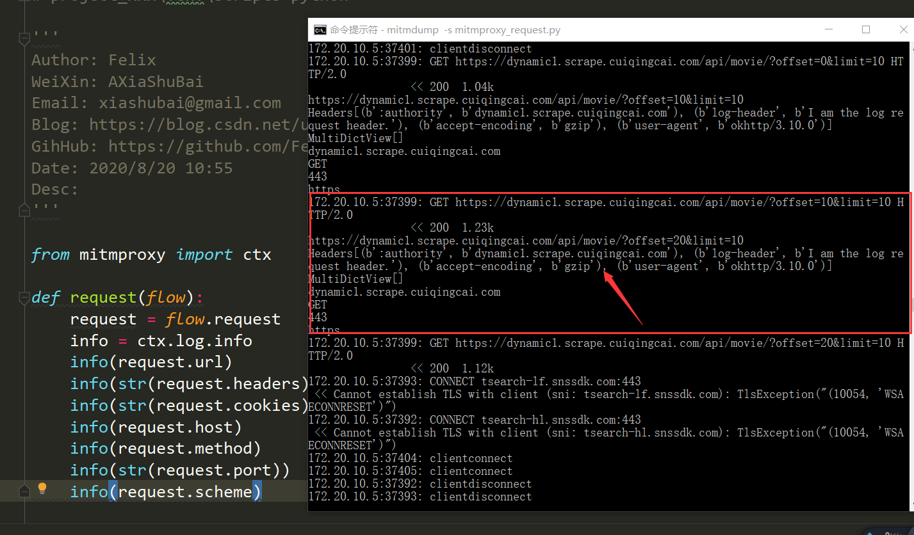
- 查看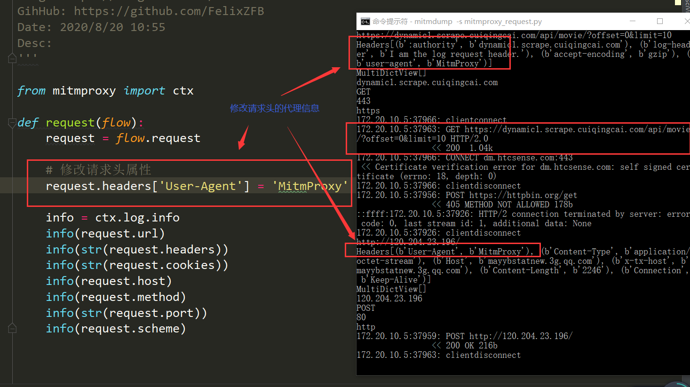


- Response 方法
    - 对于爬虫来说，我们更加关心的其实是响应的内容，因为 Response Body 才是爬取的结果。
    - 对于响应来说，mitmdump 也提供了对应的处理接口，就是 response 方法。
    - 下面我们用一个实例感受一下。
```python
from mitmproxy import ctx
def response(flow):
    response = flow.response
    info = ctx.log.info
    info(str(response.status_code))
    info(str(response.headers))
    info(str(response.cookies))
    info(str(response.text))
```

- 一样切换到项目文件下，启动脚本：
    - (venv) D:\PyProject\Python_prevent_spider\03_App反爬虫\mitmproxy安装及使用>mitmdump -s mitmproxy_response.py
    - Loading script mitmproxy_response.py
    - Proxy server listening at http://*:8080
    - 执行脚本后，然后手机打开scrape app，就会输出我们上面自定义的响应内容
    - 查看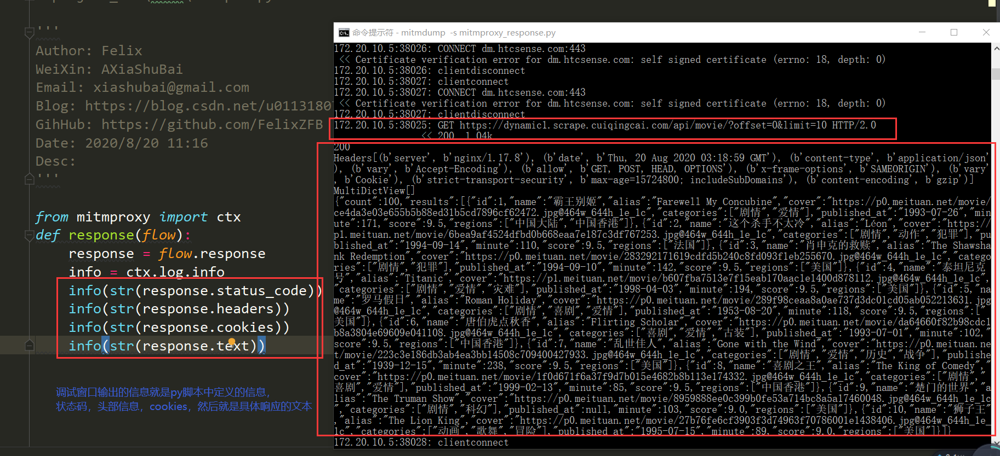


### 6.5.4 mitmproxy 实例
- 目标案例：
    - app 我们一般先通过 Charles 抓包，抓包之后我们发现其接口的 URL 中包含了一个 token 参数
    - 而且这个 token 每次请求都是变化的，我们目前也观察不出它到底是怎么构造的。
    - 如果想把抓包的这些结果保存下来，应该怎么办呢？显然就不好直接用程序来构造这些请求了，
    - 因为 token 的生成逻辑我们无从得知。这时候我们可以采取 mitmdump 实时处理的操作，
    - 只要能抓到包，那就可以把抓包的结果实时处理并保存下来。
    - 先写一个 mitmdump 脚本，还是和原来一样，保存为 spider.py

- 自定义的脚本可以边访问网页，同时保存下来我们需要的结果
    - 查看 spider.py，然后切换到脚本位置，运行脚本
    - mitmdump -s spider.py
    - 首先对 response 的内容进行了解析，然后遍历了 results 字段的每个内容，
    - 然后获取其 name 字段当作文件输出的名称，最后输出保存成一个 JSON 文件。
    - 这时候，我们再重新运行 mitmdump 和 App，就可以发现 mitmdump 的运行目录下就出现了
    - 好多 JSON 文件，这些 JSON 文件的内容就是抓包的电影数据的结果
    

## 6.6 Appium 自动化测试工具的使用 （手机端的 Selenium）
- Appium 介绍
    - Appium 是一个跨平台移动端自动化测试工具
    - 可以非常便捷地为 iOS 和 Android 平台创建自动化测试用例。
    - 它可以模拟 App 内部的各种操作，如点击、滑动、文本输入等，
    - 只要我们手工操作的动作 Appium 都可以完成。
    - 在前面我们了解过 Selenium，它是一个网页端的自动化测试工具。
    - Appium 实际上继承了 Selenium，Appium 也是利用 WebDriver 来实现 App 的自动化测试的。
    - 对 iOS 设备来说，Appium 使用 UIAutomation 来实现驱动。
    - 对于 Android 来说，它使用 UiAutomator 和 Selendroid 来实现驱动。

    - Appium 相当于一个服务器，我们可以向 Appium 发送一些操作指令，
    - Appium 就会根据不同的指令对移动设备进行驱动，完成不同的动作。

    - 对于爬虫来说，我们用 Selenium 来抓取 JavaScript 渲染的页面，可见即可爬。
    - Appium 同样也可以，对于一些不能找出api接口的动态渲染app, 用 Appium 来做 App 爬虫不失为一个好的选择。
    
    
## 6.7 airtest 更好用的自动化工具 
- 为什么选择 airtest ?
    - 6.6 介绍了 Appium 的用法，利用 Appium 可以方便地完成 App 的自动化控制，
    - 但在使用过程中或多或少还会有些不方便的地方，比如响应速度慢，提供的 API 功能有限等。
    - 再介绍另外一个更好用的自动化测试工具，叫作 airtest，它提供了一些更好用的 API，
    - 同时提供了非常强大的 IDE，开发效率和响应速度相比 Appium 也有提升。
    
- Airtest 概况
    - AirtestProject 是由网易游戏推出的一款自动化测试框架，项目构成如下。
    - Airtest：
        - 是一个跨平台的、基于图像识别的 UI 自动化测试框架，适用于游戏和 App，
        - 支持平台有 Windows、Android 和 iOS，基于 Python 实现。
    - Poco：
        - 是一款基于 UI 控件识别的自动化测试框架，目前支持 Unity3D/cocos2dx/Android 原生 App/iOS 原生 App/微信小程序，
        - 也可以在其他引擎中自行接入 poco-sdk 来使用，同样是基于 Python 实现的。
    - AirtestIDE：
        - 提供了一个跨平台的 UI 自动化测试编辑器，内置了 Airtest 和 Poco 的相关插件功能，
        - 能够使用它快速简单地编写 Airtest和 Poco代码。
    - AirLab：
        - 真机自动化云测试平台，目前提供了 TOP100 手机兼容性测试、海外云真机兼容性测试等服务。
    - 私有化手机集群技术方案：
        - 从硬件到软件，提供了企业内部私有化手机集群的解决方案。
    - 总之，Airtest 建立了一个比较完善的自动化测试解决方案，利用 Airtest 我们自然就能实现 App 内可见即可爬的爬取。

### 6.7.1 AirtestIDE 安装
- AirtestIDE 提供了非常便捷的可视化点选和代码生成等功能，你没有任何 Python 代码基础的话，
- 仅仅使用 AirtestIDE 就可以完成 App 的自动化控制和数据的爬取了。
- 但是对于大量数据的爬取和页面跳转控制这样的场景来说，如果仅仅依靠可视化点选和自动生成的代码来进行 App 的自动化控制，其实是不灵活的。
- 进一步地，如果我们再加上一些代码逻辑的话，比如一些流程控制、循环控制语句，我们就可以实现批量数据的爬取了，
- 这时候我们就需要依赖于 Airtest、Poco 以及一些自定义逻辑和第三方库来实现了。
- 建议同时安装 AirtestIDE、Airtest、Poco
- 安装参考：03_Airtest_自动化测试工具_安装及使用.MD 文档

### 6.7.2 AirtestIDE 界面说明
- 查看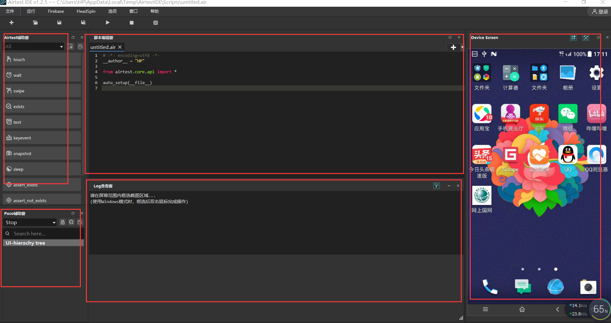
- 整个 AirtestIDE 界面被分成了三列。
    - 左侧上半部分：Airtest 辅助窗，可以通过一些点选操作实现基于图像识别的自动化配置。
    - 左侧下半部分：Poco 辅助窗，可以通过一些点选操作实现基于 UI 控件识别的自动化配置。
    - 中间上半部分：代码区域，可以通过 Airtest 辅助窗和 Poco 辅助窗自动生成代码，同时也可以自己编写代码，代码是基于 Python 语言的。
    - 中间下半部分：日志区域，会输出运行时、调试时的一些日志。
    - 右侧部分：手机的屏幕镜像。

- 在这里我们可以通过鼠标直接点触右侧部分的手机屏幕，可以发现真机或模拟器的屏幕也会跟着变化，而且响应速度非常快。

### 6.7.3 Airtest 辅助窗使用
- 下面通过 Airtest 辅助窗实现的手机自动化控制流程：    
    - 进入手机首页；
    - 点击“应用商店”；
    - 等待菜单内容加载出来；
    - 向上滑动屏幕
    
- touch: 点击屏幕
    - 菜单栏-新建脚本-.air脚本
    - Airtest 辅助器。Airtest 可以基于图像识别来实现自动化控制，我们来体验一下。
    - 比如在这里我先点击左侧的 touch 按钮，其含义就是点击。
    - 这时候 AirtestIDE 会提示我们在右侧屏幕截图，比如这里我们截取“应用商店”，
    - 这时候我们可以发现 AirtestIDE 中间的脚本编辑器中便会出现了一行代码。
    - 代码的内容为 touch，然后其参数就是一张可视化的图片。
- wait: 等待内容加载
    - 然后我们再选择 wait，其含义就是等待某个内容加载出来，同样地进行屏幕截图，
    - 如截取应用商店菜单栏的一部分，证明已经成功进入了应用商店首页。
- swipe: 滑动屏幕
    - 再然后我们点击 swipe，其含义就是滑动屏幕，这时候 AirtestIDE 会提示我们先选择一个区域，
    - 现在屏幕上选定一个区域作为触摸滑动起点，再选择滑动到目标位置作为滑动终点，鼠标点击刚刚框选区域下方一个位置
    - swipe第一个参数就是选定的区域作为滑动起点，第二个vector参数：滑动动作的矢量坐标，可以是绝对坐标 (x,y) 或是屏幕百分比，例如 (0.5, 0.5)
    - 如果要屏幕向下滑动，我们手指按住屏幕就应该向上滑动，此时就选择选定区域上方的点，y坐标为负值
    - 如果要屏幕向上滑动，我们手指按住屏幕就应该向下滑动，此时就选择选定区域下方的点，y坐标为正值  
- 键盘事件：进入手机首页
    - 代码的开头部分再加一个 keyevent，代表一些键盘事件，代码如下
    - keyevent("HOME")
- 点击运行按钮，即可发现 Airtest 便可以自动驱动手机完成上面过程自动化的操作了
- 查看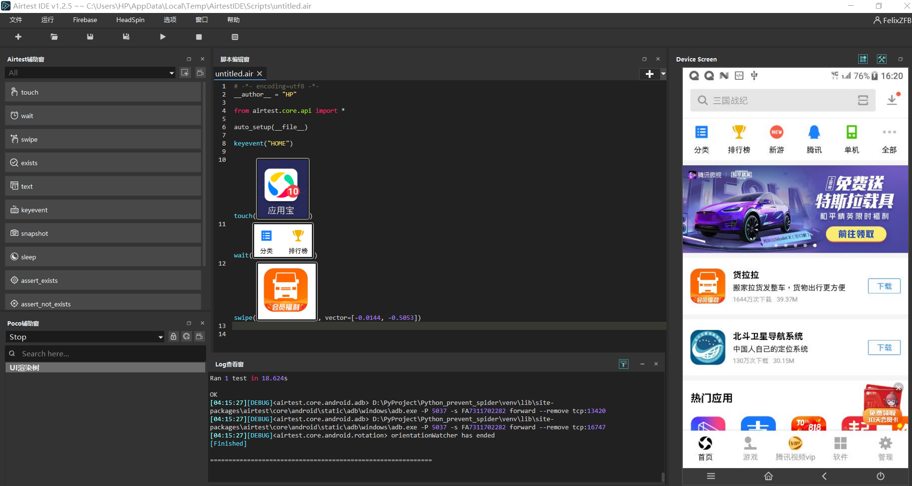
- 查看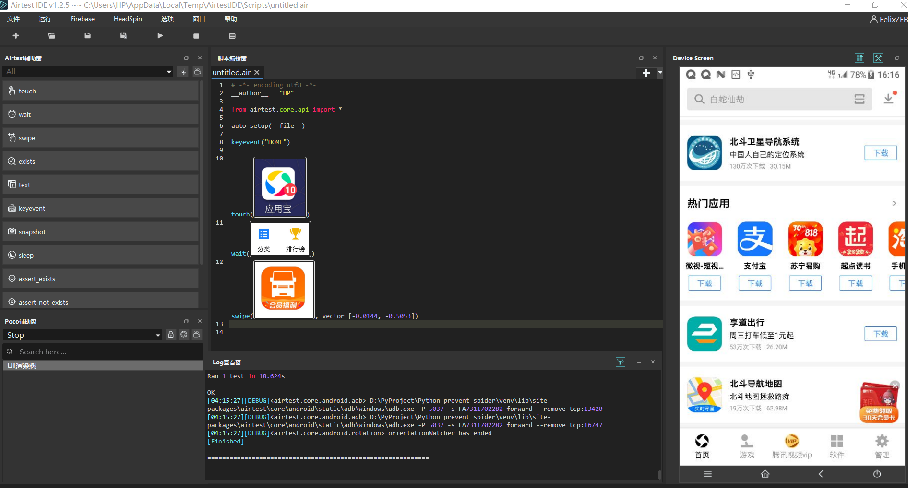

- 以上便是 Airtest 提供的基于图像识别技术的自动化控制
- 但很多情况下图像识别的速度可能不是很快，另外图像的截图也不一定是精确的，
- 而且存在一定的风险，比如有的图像更换了，那可能就会影响自动化测试的流程。
- 查看 6.7.4 节


### 6.7.4 Poco 辅助窗使用
- 一个基于 Poco 的 UI 控件自动化控制，其实说白了就是基于一些 UI 名称和属性的选择器的自动化控制，
- 有点类似于 Appium、Selenium 中的 XPath

- 新建 Poco 控制脚本
    - 新建一个脚本，然后点击左侧 Poco 辅助窗的下拉菜单，选择 Android，这时候 AirtestIDE 会提示我们更新代码，yes
    - 点击确定之后可以发现其脚本编辑器代码里面自动为我们添加了以下2行代码
```python
from poco.drivers.android.uiautomation import AndroidUiautomationPoco
poco = AndroidUiautomationPoco(use_airtest_input=True, screenshot_each_action=False)
```
    - 其实就是导入了 Poco 的 AndroidUiautomationPoco 模块，然后声明了一个 poco 对象。
    - 接下来我们就可以通过 poco 对象来选择一些内容
    - 查看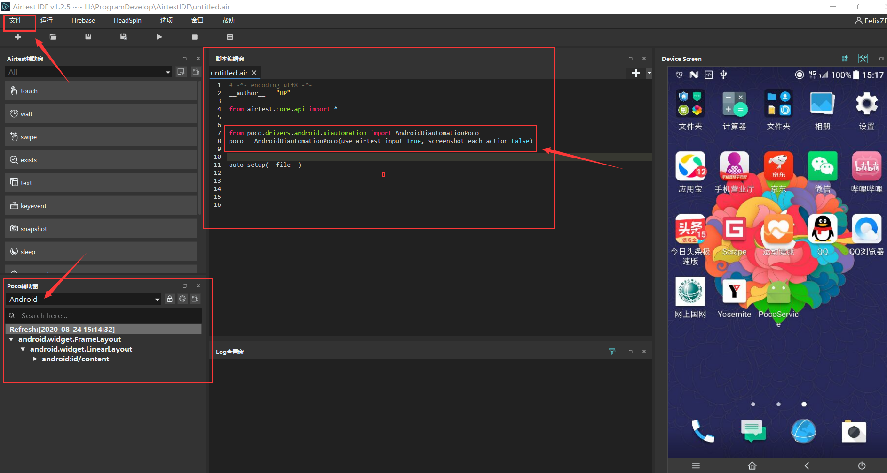


- Poco 控件树录制生成代码
    - 点击左侧的控件树，可以发现右侧的手机屏幕就有对应的区域高亮显示。
    - 这就有点像浏览器开发者工具里面选取网页源代码里面的elements，
    - 这里的 UI 控件树就类似于网页里面的 HTML DOM 树
    - 点击辅助窗的右上角的录制按钮，
    - 录制之后可以在右侧屏幕进行一些点选或滑动的一些操作，在代码区域就可以生成一些操作代码
    - 查看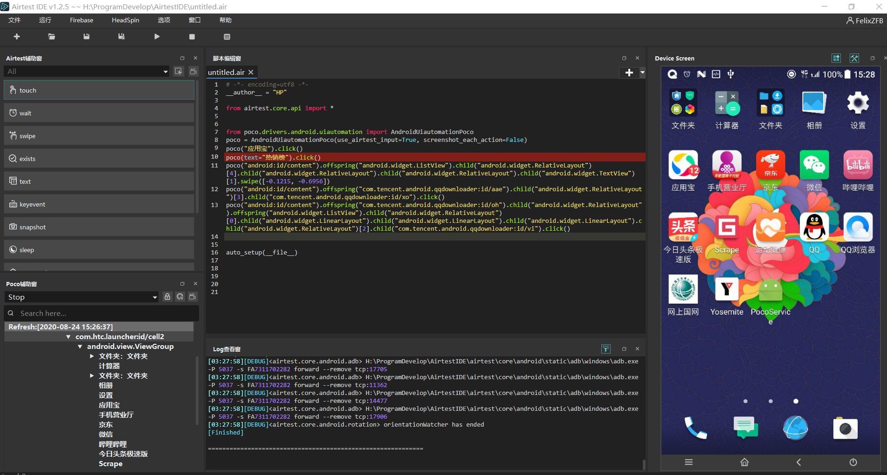
    
- Poco 对象
    - poco 对象支持通过传入一些 UI Path 来进行元素选择，最终会返回一个可操作对象。
    - poco 对象返回的可操作对象支持链式选择，如选择其子孙节点、兄弟节点、父节点等等。
    - 但其实可以观察到现在利用录制的方式自动生成的代码并不太规范，也不太灵活。
    - 6.7.5 节采用纯编程方式实现自动化控制


### 6.7.5 Poco
- Poco 是一款基于 UI 控件识别的自动化测试框架，目前支持 Unity3D/cocos2dx/Android 原生 App/iOS 原生 App/微信小程序，同样是基于 Python 实现的   
- 项目GitHub 地址为：https://github.com/AirtestProject/Poco
-  Poco 这个对象，其 API 为：
    - class Poco(agent, **options)
    - 一般来说我们会使用它的子类，比如安卓就会使用 AndroidUiautomationPoco 来声明一个 poco 对象，
    - 这个就相当于手机操作的句柄，类似于是 Selenium 中的 webdriver 对象，通过调用它的一些选择器和操作方法就可以完成手机的一些操作。
    - 具体用法：
        - poco = Poco(...)
        - close_btn = poco('close', type='Button')
    - poco 本身就是一个对象，但它是可以直接调用并传入 UI 控件的名称的，这归根结底是因为其实现了一个 __call__ 方法
    - call 方法是返回了一个 UIObjectProxy 对象，这个就对应页面中的某个 UI 组件，如一个输入框、一个按钮，等等
    
- Poco 对象常用方法
    - child
    - 选择子节点，第一个参数是 name，即 UI 控件的名称，如 android.widget.LinearLayout 等等，另外还可以额外传入一些属性来进行辅助选择。
    - 其返回结果同样是 UIObjectProxy 类型。

    - parent
    - 选择父节点，无需参数，可以直接返回当前节点的父节点，同样是 UIObjectProxy 类型。

    - sibling
    - 选择兄弟节点，第一个参数是 name，即 UI 控件的名称，另外还可以额外传入一些属性来进行辅助选择。
    - 其返回结果同样是 UIObjectProxy 类型。

    - click、rclick、double_click、long_click
    - 点击、右键点击、双击、长按操作，UIObjectProxy 对象直接调用即可。其接受参数 focus 指定点击偏移位置，sleep_interval 代表点击完成之后等待的秒数。

    - swipe
    - 滑动操作，其接收参数 direction 代表滑动方向，focus 代表滑动焦点偏移量，duration 代表完成滑动所需时间。

    - wait
    - 等待此节点出现，其接收参数 timeout 代表最长等待时间。
    
    - attr
    - 获取节点的属性，其接收参数 name 代表属性名，如 visable、text、type、pos、size 等等。
    
    - get_text
    - 获取节点的文本值，这个方法非常有用，利用它我们就可以获得某个文本节点内部的文本数据。
    
    - 另外还有很多方法，这里暂时介绍这么多，更多的方法可以参考官方文档介绍：
    - https://poco.readthedocs.io/en/latest/source/poco.proxy.html
        
### 6.7.6 Poco 爬取实例
- 爬取 ## 6.4 中的 scrape 为例，整体思路如下：
    - 由于存在大量相似的节点，所以需要用循环的方式来遍历每个节点。
    - 遍历节点之后获取到其真实的 TextView 节点，利用 get_text 方法提取文本值。
    - 初始数据只有 10 条，数据的加载需要连续不断上拉，因此需要增加滑动操作。
    - 提取的数据可能有重复，所以需要增加去重相关操作。
    - 最后加载完毕之后，检测数据量不再发生变化，停止抓取

- 代码具体查看008_AirtestIDE_python代码爬取scrapeAPP.py
- 注意：
    - AirtestIDE新建python脚本，选项设置里面自定义python解释器重置，使用软件默认解释器
    - 使用本项目python解释器是3.7，运行代码显示不支持只支持3.6版本，就不使用自定义的
    - 新建脚本窗口直接确定（弹出窗口里面不用修改）-命名后-确定
    - 复制008_AirtestIDE_python代码爬取scrapeAPP.py中代码到AirtestIDE脚本中
    - 手机亮屏，然后运行脚本，就会自动打开scrape，然后自动向上滑动加载，爬取
    - 查看