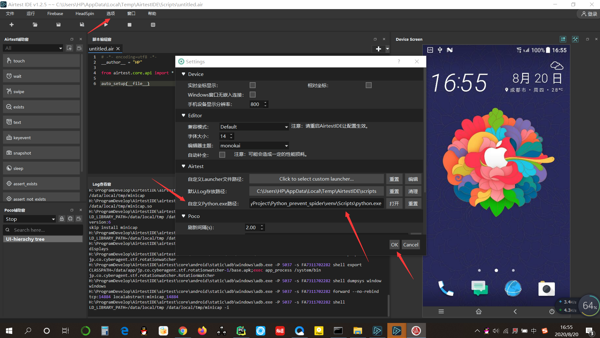
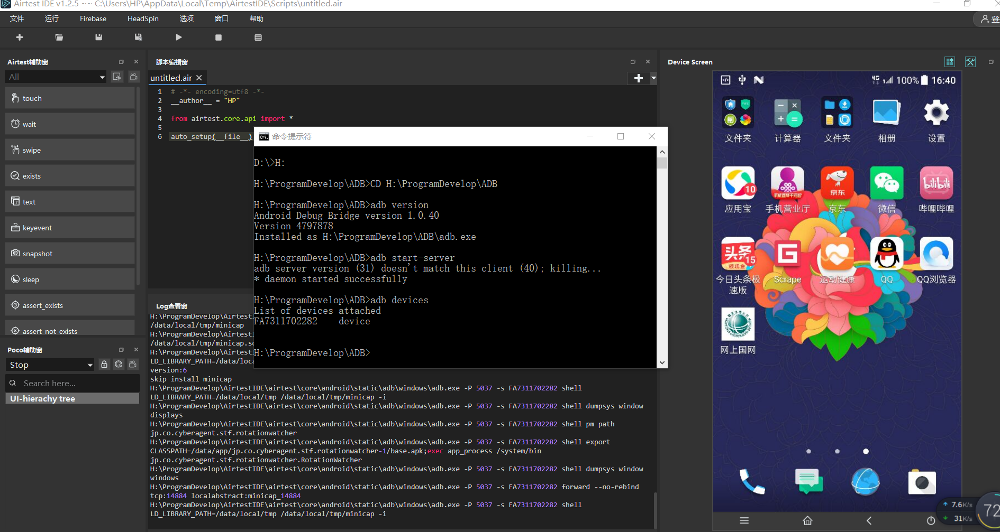

# Airtest 安装

# Airtest 概况
- AirtestProject 是由网易游戏推出的一款自动化测试框架，项目构成如下。
- Airtest：
    - 是一个跨平台的、基于图像识别的 UI 自动化测试框架，适用于游戏和 App，
    - 支持平台有 Windows、Android 和 iOS，基于 Python 实现。
- Poco：
    - 是一款基于 UI 控件识别的自动化测试框架，目前支持 Unity3D/cocos2dx/Android 原生 App/iOS 原生 App/微信小程序，
    - 也可以在其他引擎中自行接入 poco-sdk 来使用，同样是基于 Python 实现的。
- AirtestIDE：
    - 提供了一个跨平台的 UI 自动化测试编辑器，内置了 Airtest 和 Poco 的相关插件功能，
    - 能够使用它快速简单地编写 Airtest和 Poco代码。
- AirLab：
    - 真机自动化云测试平台，目前提供了 TOP100 手机兼容性测试、海外云真机兼容性测试等服务。
- 私有化手机集群技术方案：
    - 从硬件到软件，提供了企业内部私有化手机集群的解决方案。
- 总之，Airtest 建立了一个比较完善的自动化测试解决方案，利用 Airtest 我们自然就能实现 App 内可见即可爬的爬取。

# Airtest 安装说明
- AirtestIDE 提供了非常便捷的可视化点选和代码生成等功能，你没有任何 Python 代码基础的话，
- 仅仅使用 AirtestIDE 就可以完成 App 的自动化控制和数据的爬取了。
- 但是对于大量数据的爬取和页面跳转控制这样的场景来说，如果仅仅依靠可视化点选和自动生成的代码来进行 App 的自动化控制，其实是不灵活的。
- 进一步地，如果我们再加上一些代码逻辑的话，比如一些流程控制、循环控制语句，我们就可以实现批量数据的爬取了，
- 这时候我们就需要依赖于 Airtest、Poco 以及一些自定义逻辑和第三方库来实现了。
- 建议同时安装 AirtestIDE、Airtest、Poco

# 相关链接
- 官网地址：http://airtest.netease.com/index.html
- 下载地址：http://airtest.netease.com/changelog.html#v1_2_5
- 快速上手：https://airtest.doc.io.netease.com/tutorial/1_quick_start_guide/#_1
- 官方文档：https://airtest.doc.io.netease.com/

- 安装上手参考：https://airtest.doc.io.netease.com/tutorial/1_quick_start_guide/#_1

# 1 安装电脑客户端
- 目前AirtestIDE提供了Windows和Mac两个版本的客户端，请从官网下载，解压即用
- 下载地址：http://airtest.netease.com/changelog.html#v1_2_5 
- 下载的是一个ZIP格式压缩包，解压后就可以直接运行exe程序，adb安装完成，连接手机后再运行AirtestIDE

# 2 安装 airtest 和 pocoui 包
- 直接切换到项目文件夹下，使用以下安装命令
    - pip install airtest
    - pip install pocoui
    - 或者直接pycharm软件里面搜索包安装，推荐
    - 安装完成之后，可以在 AirtestIDE 中把 Python 的解释器更换成系统的 Python 解释器，
    - 而不再是 AirtestIDE 内置的 Python 解释器
    - 参考链接：
        - https://airtest.doc.io.netease.com/IDEdocs/run_script/1_useCommand_runScript/   
        - https://airtest.doc.io.netease.com/IDEdocs/settings/1_ide_settings/#python
    - AirtestIDE中使用的Python，是一个默认的Python环境，里面内置了Airtest和Poco，
    - 虽然使用起来很方便，但是假如需要使用一些其他的第三方库就无法支持了。
    - 此时我们可以通过设置本地的Python.exe路径到AirtestIDE的设置里
    - AirtestIDE菜单栏：选项-设置-自定义python.exe路径(注意重置就是使用默认AirtestIDE中的Python)-磁盘开始的完整路径即可
    - 要使用项目的虚拟环境，就需要填写虚拟环境目录下的python可执行文件路径了，
    - 例如在本项目中是：D:\PyProject\Python_prevent_spider\venv\Scripts\python.exe
    - 查看

# 3 安装 adb 
- adb介绍：
    - Android Debug Bridge（安卓调试桥） tools。
    - 它就是一个命令行窗口，用于通过电脑端与模拟器或者是设备之间的交互。
- 直接下载 adb 压缩包，解压即可
- adb安装及使用参考链接：https://www.baidu.com/link?url=Wf57ZLwTTgRWy3nGIMLrBeIIcr9FjH_9wbsUGXukwx5x9w2_G1P95Zfbflr38Ty7ZVu6nG9ae9CmsuZxJ_byHZTnY22eZI86BhRau6S9QNu&wd=&eqid=a60c2b6700034e03000000035f3e32e2
- adb使用：
    - CMD窗口切换到adb文件夹，里面有 adb.exe 
    - 然后执行相关命令即可
    - 常用命令：
        - adb version
        - 启动 adb server 命令：adb start-server
        - 停止 adb server 命令：adb kill-server
        - 查询已连接设备/模拟器：adb devices
            - 该命令经常出现以下问题：
            - offline —— 表示设备未连接成功或无响应；
            - device —— 设备已连接；
            - no device —— 没有设备/模拟器连接；
            - List of devices attached 设备/模拟器未连接到 adb 或无响应
        - 下面查看已经连接了我的安卓HTC手机，连接时候先打开USB调试，弹出窗口选择将USB用于文件传输即可
```
H:\ProgramDevelop\ADB>CD H:\ProgramDevelop\ADB

H:\ProgramDevelop\ADB>adb version
Android Debug Bridge version 1.0.40
Version 4797878
Installed as H:\ProgramDevelop\ADB\adb.exe

H:\ProgramDevelop\ADB>adb start-server
adb server version (31) doesn't match this client (40); killing...
* daemon started successfully

H:\ProgramDevelop\ADB>adb devices
List of devices attached
FA7311702282    device
```
- adb 其它实用命令：
    - 电池状况命令：adb shell dumpsys battery
    - 屏幕分辨率命令：adb shell wm size
    - 屏幕密度命令：adb shell wm density
    - 查看Android 系统版本：adb shell getprop ro.build.version.release
    - 查看设备ip地址：adb shell ifconfig | grep Mask或者adb shell netcfg
    - 查看CPU 信息命令：adb shell cat /proc/cpuinfo
    - 查看内存信息命令：adb shell cat /proc/meminfo

# 4 AirtestIDE 连接安卓设备
- 先手机数据线连接电脑，打开开发者选项中的USB调试模式，连接方式选择传输文件
- 然后CMD切换到 adb.exe 所在的文件夹，然后启动 adb 服务: adb start-server
- 然后查看设备是否连接成功，命令：adb devices
- 打开AirtestIDE，登陆，我直接用的Github账号登陆，需要邮箱进行验证
- 打开后，在AirtestIDE设备面板中点击refresh ADB 刷新按钮，查看连接上的设备，一般经过第3步，打开就已经显示连接设备了
- 如果没有显示出设备，试试重启restart ADB，
- 能够列表中成功看到设备后，点击对应设备后面的Connect按钮，进行初始化
- 此时就能在右侧列表看到手机的镜像了
- 查看

- 具体使用查看 03_0_APP反爬虫 文档中 6.6 Appium 自动化测试工具的使用