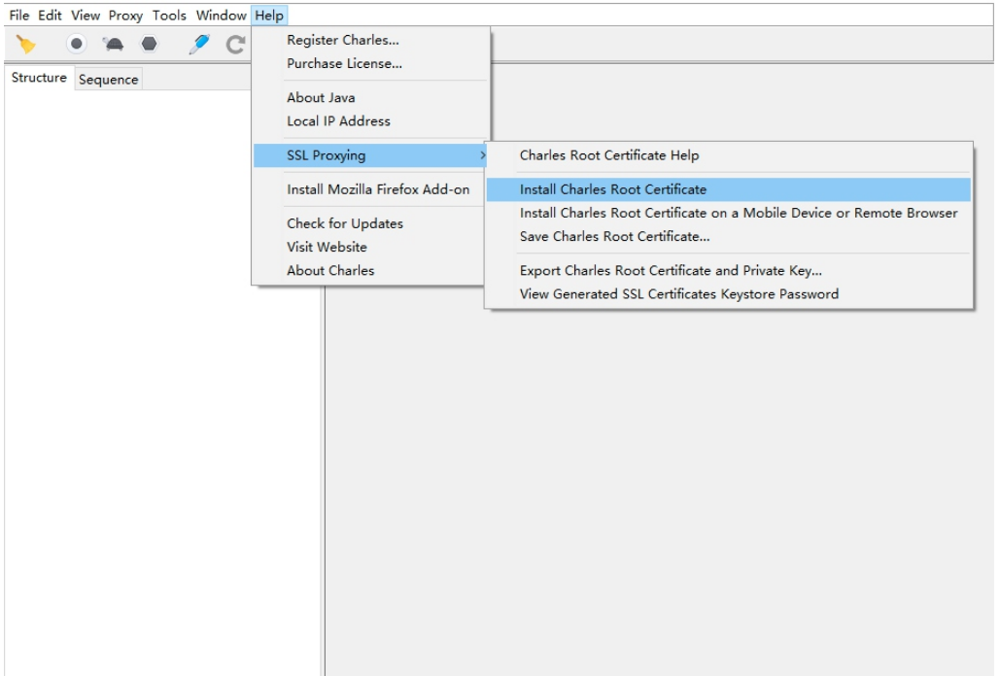
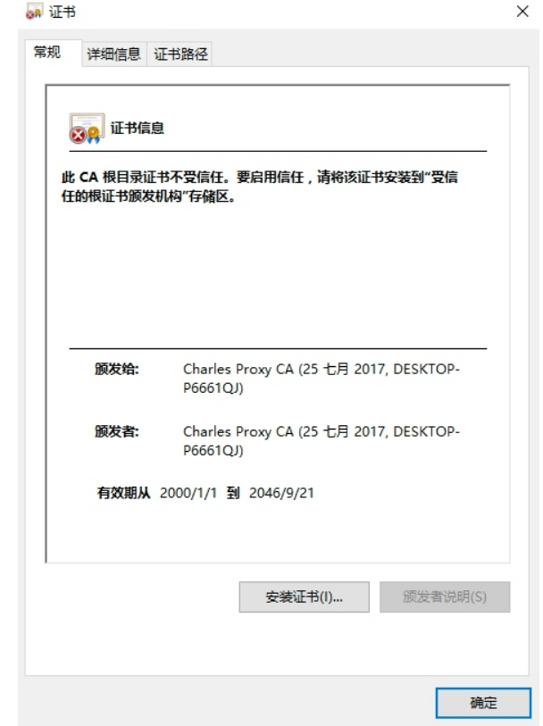
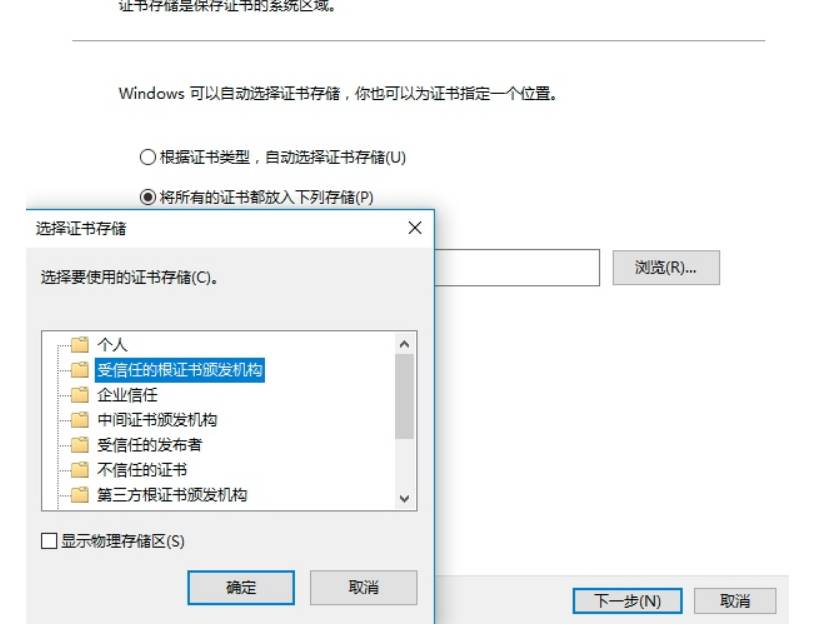
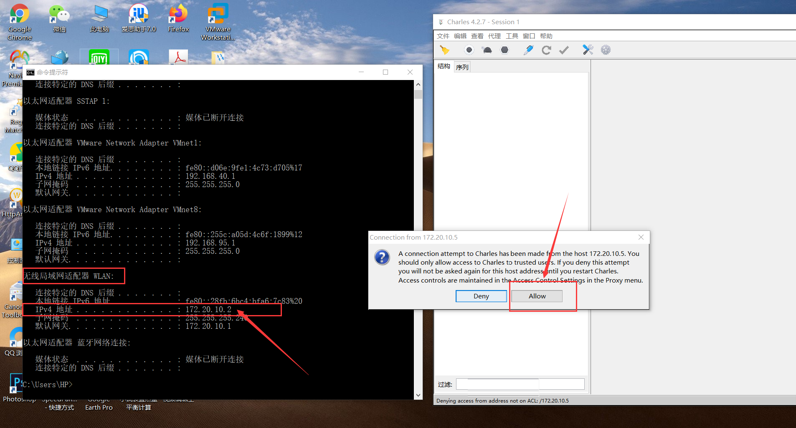
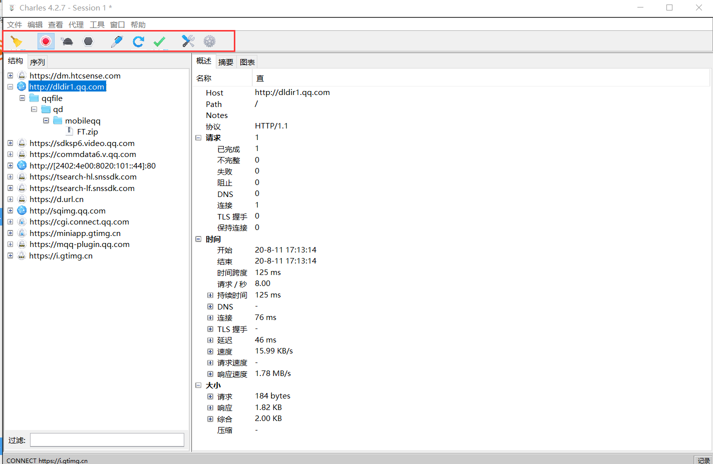
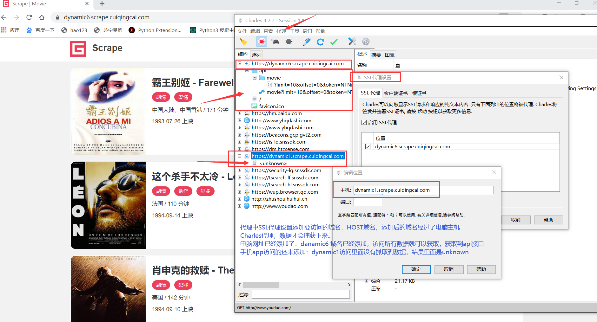
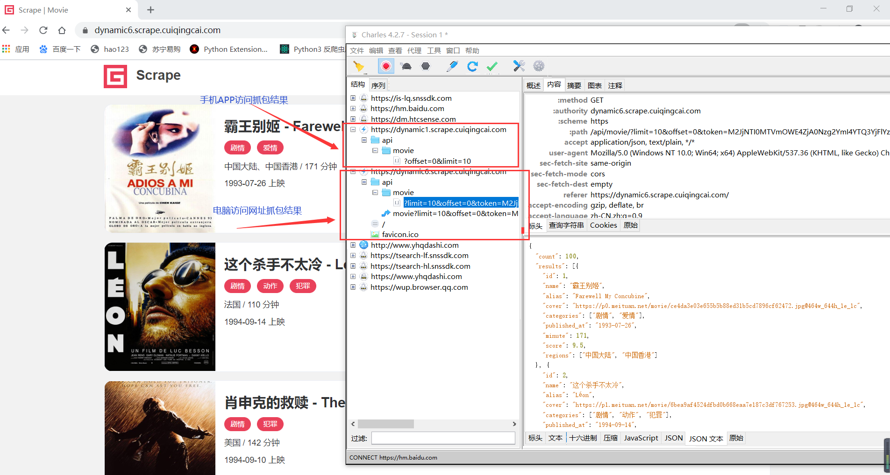

# 1 Charles 抓包工具安装及使用

- Charles 原理
    - 首先将 Charles 运行在自己的 PC 上，
    - Charles 运行的时候会在 PC 的 8888 端口开启一个代理服务，
    - 这个服务实际上是一个 HTTP/HTTPS 的代理。
    - 确保手机和 PC 在同一个局域网内，我们可以使用手机模拟器通过虚拟网络连接，
    - 也可以使用手机真机和 PC 通过无线网络连接。
    - 设置手机代理为 Charles 的代理地址，这样手机访问互联网的数据包就会流经 Charles，
    - Charles 再转发这些数据包到真实的服务器，服务器返回的数据包再由 Charles 转发回手机，
    - Charles 就起到中间人的作用，所有流量包都可以捕捉到，
    - 因此所有 HTTP 请求和响应都可以捕获到。同时 Charles 还有权力对请求和响应进行修改。

- 安装参考网址：
    - https://cuiqingcai.com/5255.html
    - https://blog.csdn.net/zw1_csdn/article/details/90719574
- 下载地址：https://www.charlesproxy.com/download

- 1 配置电脑端证书：
    - 安装完成后，如果我们想要做HTTPS抓包的话，那么还需要配置一下相关SSL证书。
    - Charles是运行在PC端的，我们要抓取的是App端的数据，所以要在PC和手机端都安装证书。
    - 首先打开Charles，点击Help→SSL Proxying→Install Charles Root Certificate
    - 接着弹出窗口点击：安装证书-当前用户-将所有的证书放入下列存储-浏览-受信任的根证书颁发机构-确定-下一步
    - 然后电脑端证书就导入完成
    - 查看
    - 查看
    - 查看

- 2 打开安卓手机，设置手机代理
    - 安卓系统版本在 7.0 及以上，可能出现 SSL Pining 的问题，最好在7.0及以下
    - 手机链接电脑的同一个无线网络(我是使用iPhone开的热点)，安卓手机(HTC ULTRA, 系统安卓 7.0 )链接时候设置代理，链接无线网时候输入密码后
    - 选择高级选项，代理服务器主机名地址设置为电脑无线局域网适配器WLAN下面的IPv4的地址(cmd窗口使用ipconfig查看电脑本机ip地址)
    - 即使用电脑端的IP地址，此处我填写的是172.20.10.2，连接后手机自动获取了ip地址为172.20.10.5
    - 端口使用Charles的默认端口：8888
    - 连接，此时电脑会弹出窗口，允许即可
    - 查看
    - 查看
    

- 3 手机端安装证书
    - 在手机浏览器上打开chls.pro/ssl，如果出现一个提示框，点击允许
    - 然后手机端为证书添加一个名称，然后点击“确定”按钮即可完成证书的安装。
    - 注意，下次连接后可能会失效，重新访问，重新安装即可
    - 查看

- 4 设置
    - 完成上面步骤后，我们先访问https://dynamic6.scrape.cuiqingcai.com/
    - 抓取到网址，但是展开网址，下面显示unknown
    - 右边详情内容里面显示：没有为此主机启用SSL代理: 在代理设置中启用, SSL 位置
    - 我们需要为要访问的域名添加到SSL代理里面
    - 菜单栏：代理-ssl代理设置-启用SSL代理-添加-主机里面填写要访问网址的域名或者主域名即可，端口不用填写
    - 然后再次访问，就可以捕获到数据了
    - 查看 
    - 查看 
    - 查看 

