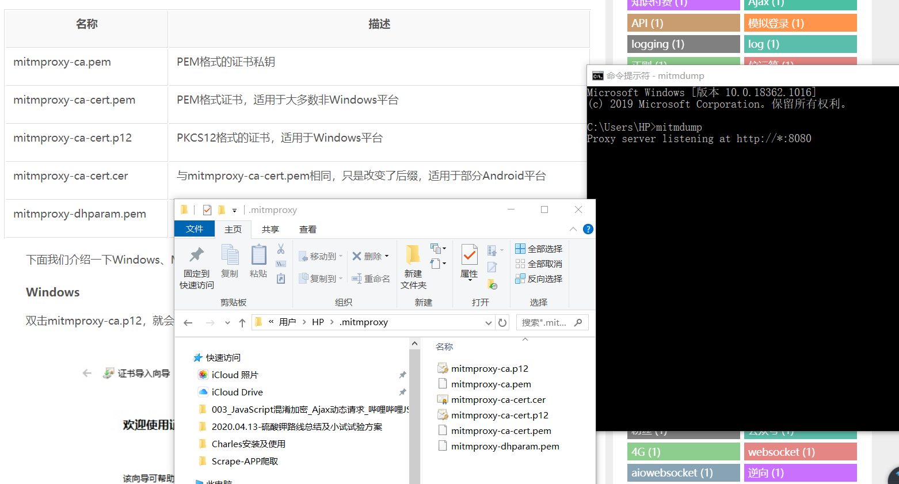

# 1 mitmproxy 的安装及使用
- mitmproxy是一个支持HTTP和HTTPS的抓包程序，类似Fiddler、Charles的功能，只不过它通过控制台的形式操作。
- mitmproxy还有两个关联组件
    - 一个是mitmdump，它是mitmproxy的命令行接口，利用它可以对接Python脚本，实现监听后的处理；
    - 另一个是mitmweb，它是一个Web程序，通过它以清楚地观察到mitmproxy捕获的请求。
    
# 2 相关链接
- GitHub：https://github.com/mitmproxy/mitmproxy
- 官方网站：https://mitmproxy.org
- PyPI：https://pypi.python.org/pypi/mitmproxy
- 官方文档：http://docs.mitmproxy.org
- mitmdump脚本：http://docs.mitmproxy.org/en/stable/scripting/overview.html
- 下载地址：https://github.com/mitmproxy/mitmproxy/releases
- 软件各个系统版本的下载地址：https://mitmproxy.org/downloads/
- DockerHub：https://hub.docker.com/r/mitmproxy/mitmproxy

# 3 最简单的安装方式
- 安装及使用参考链接：
    - https://cuiqingcai.com/5391.html

- 最简单的安装方式还是使用pip，直接进入CMD命令端或者项目虚拟环境下直接执行如下命令即可安装：
    - pip3 install mitmproxy
    - 或 pip install mitmproxy
    - pycharm 软件里面搜索安装，选择清华源安装
    - 这是最简单和通用的安装方式，执行完毕之后即可完成mitmproxy的安装，另外还附带安装了mitmdump和mitmweb这两个组件。
    - 可能会缺少一些组件导致安装失败，可以尝试下面下载软件包直接安装
    
# 4 WINDOWS 平台安装
- 选择下载Windows下的exe安装包，下载后直接双击安装包即可安装。
- 注意，在Windows上不支持mitmproxy的控制台接口，但是可以使用mitmdump和mitmweb
- 下载地址：https://mitmproxy.org/downloads/
- 其它平台安装参考：https://cuiqingcai.com/5391.html
- 在Windows系统中我们主要使用的是安装完以后的另外两个工具mitmdump和mitmweb

- 安装完成后：
    - CMD命令行输入 mitmproxy --version 会报错
    - window操作系统不支持使用 mitmproxy 这个命令，我们可以使用 mitmdump 或 mitmweb 代替
```
C:\Users\HP>mitmdump --version
Mitmproxy: 5.2 binary
Python:    3.7.8
OpenSSL:   OpenSSL 1.1.1g  21 Apr 2020
Platform:  Windows-10-10.0.18362-SP0
```

- 启动方式：
    - 方式1：windows安装完成后会自动启动 mitmproxy ui 实际就是启动 mitmdump 和 mitmweb 
    - 方式2：我们也可以进入安装文件目录的bin目录，单独启动 mitmdump 和 mitmweb 
    - 方式3：指明CMD命令行，执行 mitmdump 或 mitmweb 就启动了监听

# 5 电脑安装证书
- CMD命令行执行 mitmdump 命令
    - 用户根目录下会生成一个 .mitmproxy 文件夹里面有各个平台的证书
    - .cer是Mac或Linux下的证书，.p12是Windows下的证书，.pem是安卓下的证书
    - 此处window平台，双击mitmproxy-ca.p12，就会出现导入证书的引导页
    - 当前用户-下一步-输入密码界面不用密码直接下一步-“将所有的证书都放入下列存储”，然后点击“浏览”按钮，选择证书存储位置为“受信任的根证书颁发机构”，接着点击“确定”按钮，然后点击“下一步”按钮
    - 具体查看：https://cuiqingcai.com/5391.html
    - 查看
    
# 6 安卓手机安装证书
- 在Android手机上，同样需要将证书mitmproxy-ca-cert.pem文件发送到手机上
- 我的HTC安卓手机mitmproxy-ca-cert.pem无法识别打开，然后就换mitmproxy-ca-cert.cer文件发到手机QQ
- 然后打开文件，输入证书的名称 mitmproxy ，然后点击“确定”按钮即可完成安装成功

# 7 设置代理
- 设置手机代理和Charles抓包设置手机代理一样
    - 手机和电脑连接同一个无线网络，我用iPhone开的热点
    - 手机连接热点时候，点击高级设置，ip地址填写电脑主机的ip地址，端口填写mitmproxy的8080端口
    - 然后确定即可
    - 我之前在Charles已经设置过，直接去手机WiFi里面修改，然后修改下端口未8080即可
    
- mitmproxy 的使用查看 03_APP反爬虫 6.5 章节
